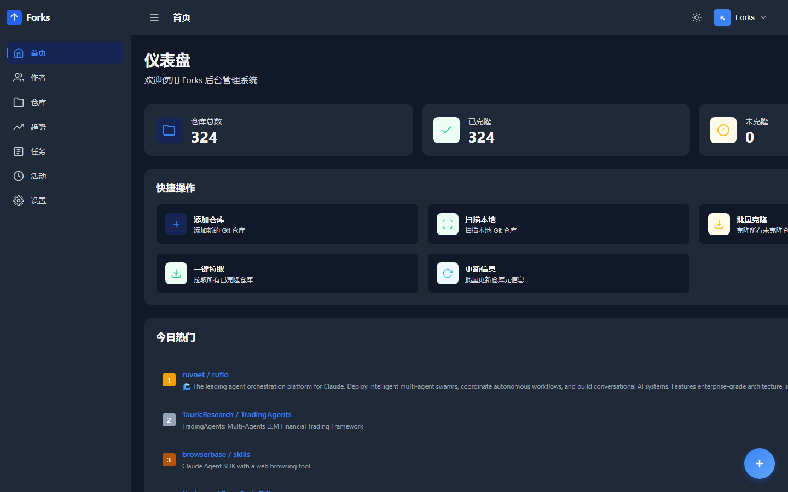
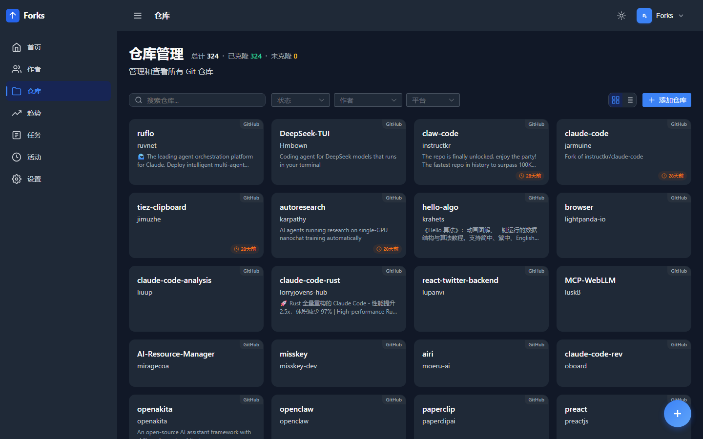
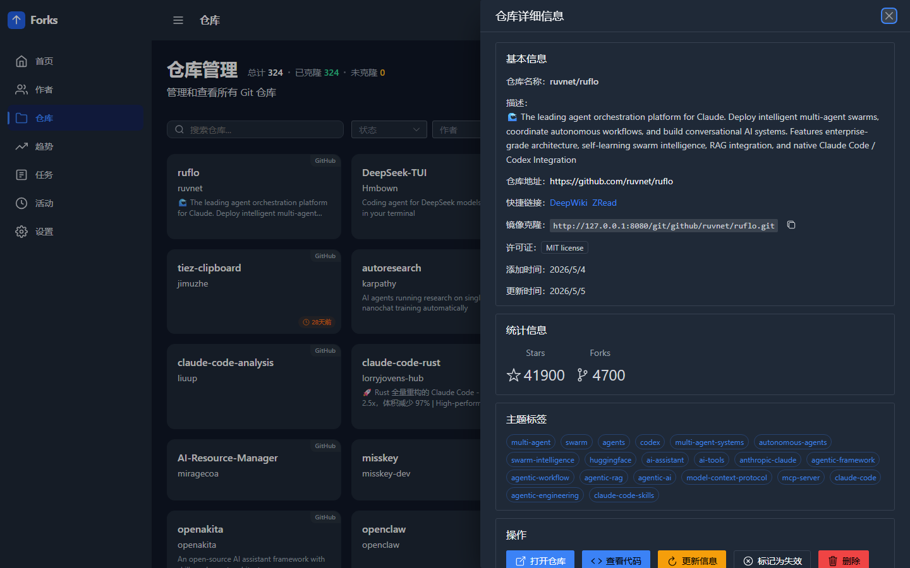
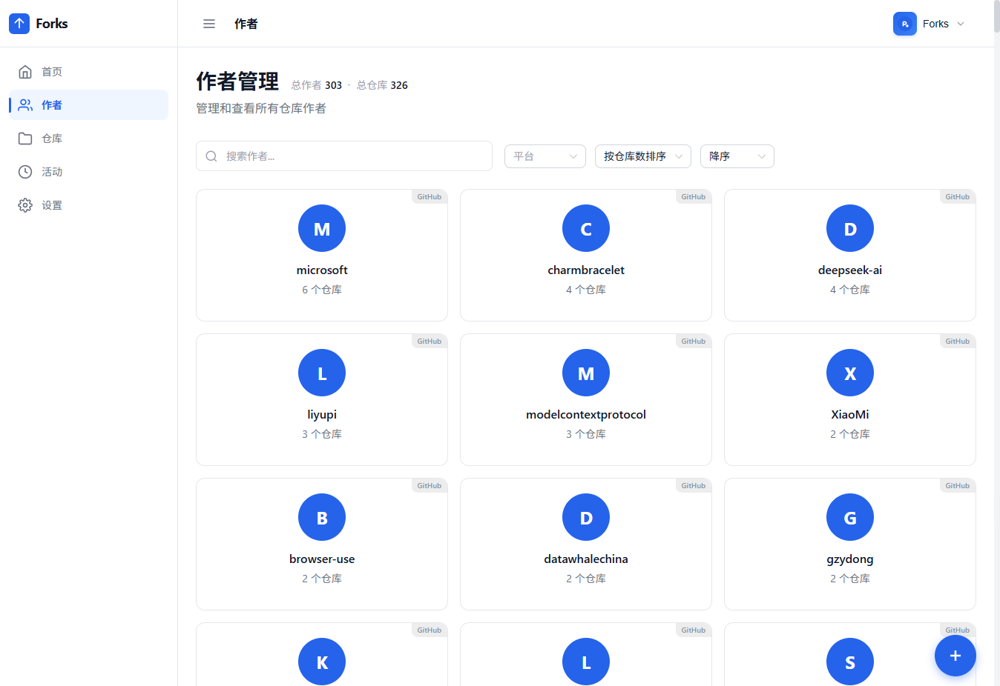
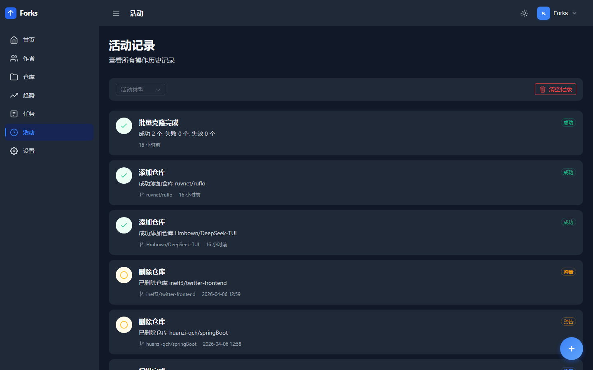
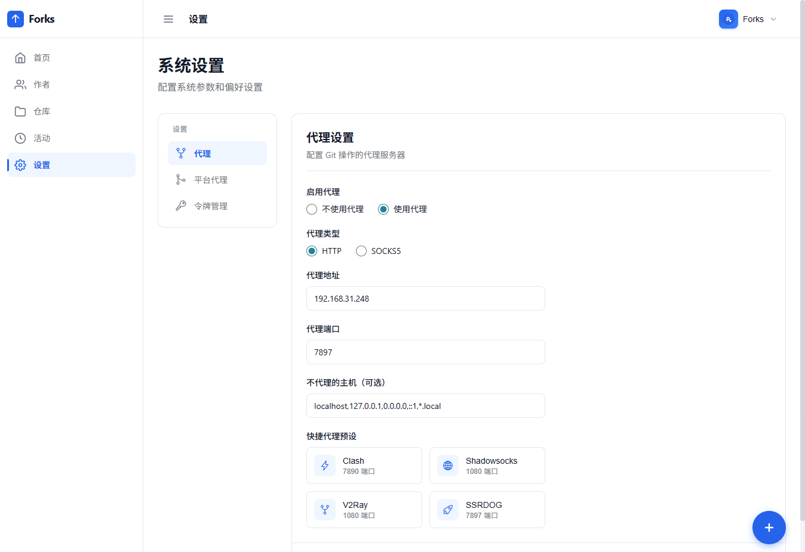

# Forks

> 本地 Git 仓库管理与镜像加速工具 — Web 界面管理 GitHub/Gitee 仓库，局域网内加速克隆。

[English](./README.en.md) | **中文**

[](https://github.com/cicbyte/forks/actions/workflows/docker-image.yml)
[](https://github.com/cicbyte/forks/releases/latest)
[](https://go.dev)
[](./LICENSE)
[](https://github.com/cicbyte/forks/pkgs/container/forks)

## 目录

- [界面预览](#界面预览)
- [功能特性](#功能特性)
- [技术栈](#技术栈)
- [快速开始](#快速开始)
- [镜像加速克隆](#镜像加速克隆)
- [Docker 部署](#docker-部署)
- [MCP 集成](#mcp-集成)
- [配套工具](#配套工具)
- [项目结构](#项目结构)
- [License](#license)

## 界面预览

**首页仪表盘** — 仓库统计与快捷操作


**仓库列表** — 搜索、筛选、批量操作


**仓库详情** — 仓库信息与克隆地址


**作者** — 按作者聚合查看仓库


**活动记录** — 操作日志追踪


**设置** — 代理、Token 等系统配置


## 功能特性

- **仓库管理** — 添加、克隆、拉取、重置 GitHub/Gitee 仓库
- **批量操作** — 批量克隆未克隆的仓库，扫描本地目录自动导入
- **文件浏览** — 在线浏览仓库文件树和文件内容（多语言语法高亮、Markdown 渲染、图片/音视频预览）
- **状态监控** — 实时查看克隆进度、更新差异、提交历史
- **镜像加速** — 内置 Git Smart HTTP 服务，局域网内可从本服务加速克隆
- **MCP 集成** — 暴露 MCP 工具接口，支持 Claude Code、Cursor 等 AI 客户端直接操作仓库
- **代理支持** — HTTP/SOCKS5 代理，支持按平台独立配置
- **数据统计** — 仓库和作者的统计仪表盘，操作日志追踪

## 技术栈

| 层 | 技术 |
|---|---|
| 后端 | Go 1.25、Gin、SQLite (modernc)、Cobra |
| 前端 | Vue 3、Naive UI、CodeMirror、Pinia、ECharts |
| 构建 | Vite 7、go:embed |
| 部署 | Docker、GitHub Actions |

## 快速开始

### 环境要求

- Go 1.25+
- Node.js `^20.19.0` 或 `>=22.12.0`（仅前端开发需要）

### 构建

```bash
# 构建前端
cd web && npm install && npm run build && cd ..

# 构建后端（会将前端嵌入二进制）
go build -o forks
```

### 运行

```bash
./forks serve                # 默认监听 :8080
./forks serve -p 9090        # 指定端口
./forks serve --token xxx    # 启用 Token 认证
```

**环境变量：**

| 变量 | 说明 | 默认值 |
|---|---|---|
| `FORKS_PORT` | 服务端口 | 8080 |
| `FORKS_ADDRESS` | 监听地址 | 0.0.0.0 |
| `FORKS_HOME` | 数据目录 | `~/.cicbyte/forks/` |
| `FORKS_REPO_PATH` | 仓库存储路径 | 交互式输入 |
| `TZ` | 时区 | UTC |

优先级：命令行参数 > 环境变量 > 默认值。首次运行会提示输入仓库存储路径。

### 前端开发

```bash
cd web && npm install && npm run dev
# 开发服务器 http://localhost:3000，自动代理 API 到 :8080
```

## 镜像加速克隆

Forks 内置 Git Smart HTTP 协议服务，部署后局域网内其他机器可直接从本服务克隆已缓存的仓库，无需访问外网。

```bash
# 直接 git clone（克隆后 origin 会指向镜像地址）
git clone http://<server-ip>:8080/git/github/author/repo.git

# 推荐使用 fclone 工具（自动修正 remote 地址）
fclone http://<server-ip>:8080/git/github/author/repo.git
```

## Docker 部署

### 使用预构建镜像（推荐）

```bash
docker run -d \
  -p 8080:8080 \
  -e TZ=Asia/Shanghai \
  -v ./data:/data \
  ghcr.io/cicbyte/forks:latest
```

使用 `docker-compose.yml`：

```bash
docker compose up -d
```

### 自行构建

```bash
docker build -t forks .
docker run -d -p 8080:8080 -v ./data:/data forks
```

## MCP 集成

通过 [MCP (Model Context Protocol)](https://modelcontextprotocol.io) Streamable HTTP 暴露工具接口，AI 客户端可直接操作仓库。

**端点：** `http://<server>:8080/mcp`

**可用工具：**

| 工具 | 功能 |
|---|---|
| `list_repos` | 列出仓库（支持搜索/筛选/分页） |
| `add_repo` | 添加仓库 |
| `get_repo` | 获取单个仓库详情 |
| `update_repo_info` | 更新仓库远程信息 |
| `get_stats` | 获取仓库统计信息 |
| `list_repo_files` | 列出仓库文件结构 |
| `read_repo_file` | 读取仓库文件内容 |

认证方式与 API 相同，使用 Bearer Token。

## 配套工具

### fclone — 镜像加速克隆

独立 CLI 工具，位于 `fclone/`，零依赖。克隆后自动修正 remote 指向原始仓库。

```bash
cd fclone && go build -o fclone .
fclone http://<server-ip>:8080/git/github/torvalds/linux.git
fclone http://<server-ip>:8080/git/github/torvalds/linux.git my-linux  # 指定目录
```

### fbackup — 批量备份

独立 CLI 工具，位于 `fbackup/`，从 Forks 服务端并发备份仓库到本地。

```bash
cd fbackup && go build -o fbackup
fbackup config server http://<server-ip>:8080
fbackup config token xxx
fbackup config dir /data/backup
fbackup                    # 默认 5 并发
fbackup -c 10              # 指定并发数
```

通过 Git HTTP 接口局域网复制，已存在的仓库执行 `git pull --ff-only`。配置文件：`~/.fbackup.json`。

## 项目结构

```
├── main.go              # 入口，嵌入 web/dist
├── cmd/
│   ├── root.go          # CLI 根命令，数据库和日志初始化
│   └── serve.go         # HTTP 路由和业务逻辑
├── common/              # 全局变量（DB、日志文件）
├── models/              # 数据结构定义
├── utils/               # 配置、GitHub API、MCP 服务、工具函数
├── assets/              # 嵌入资源桥接
├── fclone/              # 独立 CLI（镜像加速克隆）
├── fbackup/             # 独立 CLI（批量备份）
└── web/                 # Vue 3 前端
    └── src/
        ├── api/         # API 调用封装
        ├── views/       # 页面组件
        ├── components/  # 通用组件
        ├── stores/      # Pinia 状态管理
        └── router/      # 路由配置
```

## License

[MIT](./LICENSE)
